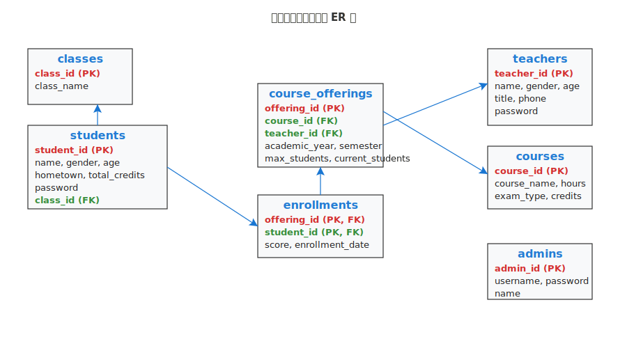

# 教务系统选课系统

一个基于Vue 3 + Python Flask的前后端分离教务系统选课管理平台。

## 技术栈

### 前端
- Vue 3
- Vite
- JavaScript
- Material Design 3 (Vuetify 3)
- Vue Router
- Pinia (状态管理)

### 后端
- Python Flask
- SQLAlchemy
- Flask-JWT-Extended (JWT认证)
- Flask-CORS (跨域处理)
- PyMySQL (数据库连接)

### 数据库
- MariaDB

## 项目结构

```
CourseSelectionSystem/
├── 需求.md                   # 项目需求文档
├── README.md                 # 项目说明文档
├── .gitignore               # Git忽略文件配置
├── frontend/                 # Vue 3 前端项目
│   ├── index.html           # HTML入口文件
│   ├── package.json         # 前端依赖配置
│   ├── package-lock.json    # 依赖版本锁定
│   ├── vite.config.js       # Vite构建配置
│   ├── node_modules/        # 前端依赖包
│   └── src/
│       ├── App.vue          # 根组件
│       ├── main.js          # 应用入口
│       ├── plugins/
│       │   └── vuetify.js   # Vuetify UI框架配置
│       ├── router/
│       │   └── index.js     # Vue Router路由配置
│       ├── stores/
│       │   └── auth.js      # Pinia状态管理（认证）
│       ├── styles/
│       │   └── dashboard.css # 通用Dashboard样式
│       ├── utils/
│       │   └── api.js       # API请求工具
│       └── views/           # 页面组件
│           ├── Login.vue    # 登录页面
│           ├── NotFound.vue # 404页面
│           ├── admin/       # 管理员页面
│           │   ├── Dashboard.vue        # 管理员仪表板
│           │   ├── Overview.vue         # 系统总览
│           │   ├── TeacherManagement.vue # 教师管理
│           │   ├── StudentManagement.vue # 学生管理
│           │   ├── CourseManagement.vue  # 课程管理
│           │   └── ClassManagement.vue   # 班级管理
│           ├── teacher/     # 教师页面
│           │   ├── Dashboard.vue    # 教师仪表板
│           │   ├── Overview.vue     # 教师总览
│           │   ├── Courses.vue      # 我的课程
│           │   ├── Students.vue     # 学生管理
│           │   ├── Grades.vue       # 成绩管理
│           │   └── Statistics.vue   # 统计分析
│           ├── student/     # 学生页面
│           │   ├── Dashboard.vue    # 学生仪表板
│           │   ├── Overview.vue     # 学生总览
│           │   ├── Courses.vue      # 课程浏览
│           │   ├── Enrollment.vue   # 选课管理
│           │   └── Grades.vue       # 我的成绩
│           └── common/      # 通用页面
│               └── Profile.vue      # 个人信息
├── backend/                  # Flask 后端项目
│   ├── run.py               # 后端启动文件
│   ├── create_db.py         # 数据库创建脚本
│   ├── init_data.py         # 初始数据脚本
│   ├── requirements.txt     # Python依赖配置
│   ├── .env                 # 环境变量配置
│   ├── .env.example         # 环境变量模板
│   └── app/                 # 应用核心代码
│       ├── __init__.py      # Flask应用初始化
│       ├── models/          # 数据模型
│       │   └── __init__.py  # 数据模型定义
│       └── routes/          # API路由
│           ├── auth.py      # 认证相关API
│           ├── common.py    # 通用API
│           ├── admin.py     # 管理员API
│           ├── teacher.py   # 教师API
│           └── student.py   # 学生API
└── database/                 # 数据库相关
    └── init.sql             # MySQL数据库初始化脚本
```

## 功能特性

### 管理员功能
- 教师信息管理（增删改查）
- 学生信息管理（增删改查）
- 课程信息管理（增删改查）
- 密码修改

### 教师功能
- 查看个人信息
- 查看任课信息
- 开设/取消课程
- 学生成绩管理
- 班级学生排名查看
- 课程成绩统计
- 密码修改

### 学生功能
- 查看个人信息
- 查看已选课程
- 选课/退选
- 成绩查询
- 密码修改

## 部署说明

### 环境要求

- **Python**: 3.8 或更高版本
- **Node.js**: 16.0 或更高版本
- **数据库**: MariaDB 10.5+ 或 MySQL 8.0+
- **操作系统**: Windows 10/11, Linux, macOS

### 1. 数据库安装与配置

#### 1.1 安装MariaDB
```bash
# Windows (使用Chocolatey)
choco install mariadb

# 或下载安装包
# https://mariadb.org/download/

# Linux (Ubuntu/Debian)
sudo apt update
sudo apt install mariadb-server

# macOS (使用Homebrew)
brew install mariadb
```

#### 1.2 启动数据库服务
```bash
# Windows
net start MariaDB

# Linux
sudo systemctl start mariadb
sudo systemctl enable mariadb

# macOS
brew services start mariadb
```

#### 1.3 创建数据库和用户
```sql
# 登录MariaDB
mysql -u root -p

# 创建数据库
CREATE DATABASE course_selection_system CHARACTER SET utf8mb4 COLLATE utf8mb4_unicode_ci;

# 创建用户（可选，也可以使用root用户）
CREATE USER 'course_user'@'localhost' IDENTIFIED BY 'your_password';
GRANT ALL PRIVILEGES ON course_selection_system.* TO 'course_user'@'localhost';
FLUSH PRIVILEGES;

# 退出
EXIT;
```

#### 1.4 导入数据库结构和初始数据
```bash
# 在项目根目录执行
mysql -u root -p course_selection_system < database/init.sql
```

### 2. 后端部署

#### 2.1 安装Python依赖
```bash
# 进入后端目录
cd backend

# 创建conda环境（推荐）
conda create -n course_env python=3.8

# 激活conda环境
conda activate course_env

# 安装依赖
pip install -r requirements.txt
```

#### 2.2 配置环境变量
```bash
# 复制环境配置模板
copy .env.example .env  # Windows
# cp .env.example .env    # Linux/macOS

# 编辑.env文件，配置数据库连接
```

**.env 配置示例：**
```env
# 数据库配置
DB_HOST=localhost
DB_PORT=3306
DB_USER=root
DB_PASSWORD=your_database_password
DB_NAME=course_selection_system

# 安全密钥（请在生产环境中更改）
SECRET_KEY=your-super-secret-key-change-in-production
JWT_SECRET_KEY=your-jwt-secret-key-change-in-production

# 其他配置
FLASK_ENV=development
FLASK_DEBUG=True
```

#### 2.3 启动后端服务
```bash
# 在backend目录下
python run.py

# 后端服务将在 http://localhost:5000 启动
```

### 3. 前端部署

#### 3.1 安装Node.js依赖
```bash
# 进入前端目录
cd frontend

# 安装依赖
npm install
# 或使用yarn
yarn install
```

#### 3.2 启动开发服务器
```bash
# 启动开发服务器
npm run dev
# 或使用yarn
yarn dev

# 前端服务将在 http://localhost:3000 启动
```

#### 3.3 生产环境构建
```bash
# 构建生产版本
npm run build
# 或使用yarn
yarn build

# 构建文件将在 dist/ 目录中生成
```

### 4. 生产环境部署

#### 4.1 后端生产部署
```bash
# 使用Gunicorn部署Flask应用
pip install gunicorn

# 启动生产服务器
gunicorn -w 4 -b 0.0.0.0:5000 run:app

# 或使用配置文件
gunicorn -c gunicorn.conf.py run:app
```

**gunicorn.conf.py 示例：**
```python
bind = "0.0.0.0:5000"
workers = 4
worker_class = "sync"
timeout = 30
keepalive = 2
max_requests = 1000
max_requests_jitter = 50
preload_app = True
```

#### 4.2 前端生产部署
```bash
# 1. 构建项目
npm run build

# 2. 使用Nginx部署静态文件
# 将dist/目录内容复制到Nginx web根目录

# 3. 或使用Node.js静态服务器
npm install -g serve
serve -s dist -l 3000
```

**Nginx配置示例：**
```nginx
server {
    listen 80;
    server_name your-domain.com;
    root /path/to/frontend/dist;
    index index.html;

    location / {
        try_files $uri $uri/ /index.html;
    }

    location /api {
        proxy_pass http://localhost:5000;
        proxy_set_header Host $host;
        proxy_set_header X-Real-IP $remote_addr;
    }
}
```

### 5. 验证部署

#### 5.1 检查服务状态
```bash
# 检查后端API
curl http://localhost:5000/api/common/academic-years

# 检查前端页面
# 打开浏览器访问 http://localhost:3000
```

#### 5.2 测试登录
使用以下默认账号测试系统功能：

| 用户类型 | 用户名 | 密码 | 说明 |
|---------|--------|------|------|
| 管理员 | admin | 123456 | 系统管理员账号 |
| 教师 | T001 | 123456 | 测试教师账号 |
| 学生 | 202301001001 | 123456 | 测试学生账号 |

### 6. 常见问题

#### 6.1 数据库连接失败
- 检查MariaDB/MySQL服务是否启动
- 验证.env文件中的数据库配置
- 确认数据库用户权限

#### 6.2 后端启动失败
- 检查Python版本和依赖安装
- 查看错误日志定位问题
- 确认端口5000未被占用

#### 6.3 前端无法访问后端API
- 检查CORS配置
- 验证代理设置（vite.config.js）
- 确认后端服务正常运行

#### 6.4 前端路由404错误
- 确认使用History模式路由
- 配置服务器重定向到index.html
- 检查路由路径配置

### 7. 开发环境快速启动

#### 7.1 一键启动脚本
```bash
# Windows PowerShell
# 启动后端
Start-Process powershell -ArgumentList "cd backend; python run.py"

# 启动前端
Start-Process powershell -ArgumentList "cd frontend; npm run dev"
```

```bash
# Linux/macOS
# 创建启动脚本 start.sh
#!/bin/bash
cd backend && python run.py &
cd frontend && npm run dev &
wait
```

## 数据库设计

### 实体关系图（ERD）

> 下图为本系统主要数据库表的ER图：

<p align="center">
  
</p>

### 实体关系分析

本系统采用学年制管理学籍，具有以下特点：
- 开设班级，每个班级包含若干学生
- 课程由教师开设，同一门课可能有多个教师开课
- 一个教师在一学期可能开多门课程
- 所有课程均由学生自由选择（不按班级直接开课）
- 一个学生只能选择某位老师开的某个课程（不能同时选择同一门课的不同教师）
- 不存在多个教师联合开课的情况

### 数据库表结构

#### 1. 班级表 (classes)
| 字段名 | 数据类型 | 长度 | 约束 | 说明 |
|--------|----------|------|------|------|
| class_id | VARCHAR | 4 | 主键，非空 | 班级编号 |
| class_name | VARCHAR | 20 | 非空 | 班级名称 |
| created_at | TIMESTAMP | - | 默认当前时间 | 创建时间 |
| updated_at | TIMESTAMP | - | 更新时自动修改 | 更新时间 |

#### 2. 学生表 (students)
| 字段名 | 数据类型 | 长度 | 约束 | 说明 |
|--------|----------|------|------|------|
| student_id | VARCHAR | 12 | 主键，非空 | 学号 |
| name | VARCHAR | 5 | 非空 | 姓名 |
| gender | VARCHAR | 1 | 非空 | 性别 |
| age | INT | 4 | 非空 | 年龄 |
| hometown | VARCHAR | 20 | 非空 | 生源所在地 |
| total_credits | FLOAT | 4 | 默认0 | 已修学分总数 |
| password | VARCHAR | 255 | 非空 | 登录密码（加密存储） |
| class_id | VARCHAR | 4 | 外键，非空 | 班级编号 |
| created_at | TIMESTAMP | - | 默认当前时间 | 创建时间 |
| updated_at | TIMESTAMP | - | 更新时自动修改 | 更新时间 |

**外键约束**: class_id → classes(class_id)

#### 3. 课程表 (courses)
| 字段名 | 数据类型 | 长度 | 约束 | 说明 |
|--------|----------|------|------|------|
| course_id | VARCHAR | 5 | 主键，非空 | 课程编号 |
| course_name | VARCHAR | 20 | 非空 | 课程名称 |
| hours | INT | 4 | 非空 | 学时 |
| exam_type | BOOLEAN | 1 | 非空 | 考试类型（1:考试，0:考查） |
| credits | FLOAT | 4 | 非空 | 学分 |
| created_at | TIMESTAMP | - | 默认当前时间 | 创建时间 |
| updated_at | TIMESTAMP | - | 更新时自动修改 | 更新时间 |

#### 4. 教师表 (teachers)
| 字段名 | 数据类型 | 长度 | 约束 | 说明 |
|--------|----------|------|------|------|
| teacher_id | VARCHAR | 5 | 主键，非空 | 教师编号 |
| name | VARCHAR | 20 | 非空 | 姓名 |
| gender | VARCHAR | 1 | 非空 | 性别 |
| age | INT | 4 | 非空 | 年龄 |
| title | VARCHAR | 10 | 非空 | 职称 |
| phone | VARCHAR | 20 | 非空 | 电话 |
| password | VARCHAR | 255 | 非空 | 登录密码（加密存储） |
| created_at | TIMESTAMP | - | 默认当前时间 | 创建时间 |
| updated_at | TIMESTAMP | - | 更新时自动修改 | 更新时间 |

#### 5. 开课情况表 (course_offerings)
| 字段名 | 数据类型 | 长度 | 约束 | 说明 |
|--------|----------|------|------|------|
| offering_id | VARCHAR | 15 | 主键，非空 | 开课编号 |
| course_id | VARCHAR | 5 | 外键，非空 | 课程编号 |
| teacher_id | VARCHAR | 5 | 外键，非空 | 任课教师编号 |
| academic_year | VARCHAR | 4 | 非空 | 开课学年 |
| semester | BOOLEAN | 1 | 非空 | 开课学期（1:第一学期，0:第二学期） |
| max_students | INT | 4 | 默认50 | 最大选课人数 |
| current_students | INT | 4 | 默认0 | 当前选课人数 |
| created_at | TIMESTAMP | - | 默认当前时间 | 创建时间 |
| updated_at | TIMESTAMP | - | 更新时自动修改 | 更新时间 |

**外键约束**: 
- course_id → courses(course_id)
- teacher_id → teachers(teacher_id)

#### 6. 选课情况表 (enrollments)
| 字段名 | 数据类型 | 长度 | 约束 | 说明 |
|--------|----------|------|------|------|
| offering_id | VARCHAR | 15 | 联合主键，外键 | 开课编号 |
| student_id | VARCHAR | 12 | 联合主键，外键 | 学号 |
| score | INT | 4 | 可空 | 成绩 |
| enrollment_date | TIMESTAMP | - | 默认当前时间 | 选课时间 |
| updated_at | TIMESTAMP | - | 更新时自动修改 | 更新时间 |

**联合主键**: (offering_id, student_id)
**外键约束**: 
- offering_id → course_offerings(offering_id)
- student_id → students(student_id)

#### 7. 管理员表 (admins)
| 字段名 | 数据类型 | 长度 | 约束 | 说明 |
|--------|----------|------|------|------|
| admin_id | VARCHAR | 10 | 主键，非空 | 管理员编号 |
| username | VARCHAR | 20 | 唯一，非空 | 用户名 |
| password | VARCHAR | 255 | 非空 | 登录密码（加密存储） |
| name | VARCHAR | 20 | 非空 | 姓名 |
| created_at | TIMESTAMP | - | 默认当前时间 | 创建时间 |
| updated_at | TIMESTAMP | - | 更新时自动修改 | 更新时间 |

### 数据库索引设计

为提高查询性能，创建了以下索引：
- `idx_students_class`: students表的class_id字段
- `idx_course_offerings_course`: course_offerings表的course_id字段
- `idx_course_offerings_teacher`: course_offerings表的teacher_id字段
- `idx_course_offerings_year_semester`: course_offerings表的academic_year和semester字段组合索引
- `idx_enrollments_student`: enrollments表的student_id字段
- `idx_enrollments_offering`: enrollments表的offering_id字段

### 业务规则与约束

1. **选课约束**：
   - 学生不能重复选择同一个开课（offering_id + student_id 唯一）
   - 学生不能选择同一门课程的不同教学班
   - 开课人数不能超过最大限制

2. **成绩管理**：
   - 成绩≥60分为及格，自动累加学分到学生总学分
   - 成绩修改时自动更新学生总学分

3. **开课管理**：
   - 开课编号格式：{学年}-{学期}-{课程编号}-{教师编号}
   - 同一教师同一学期不能重复开设同一门课程

4. **密码安全**：
   - 所有密码使用bcrypt加密存储
   - 支持密码修改功能

### 示例数据

系统初始化时包含以下示例数据：
- **管理员**: admin / 123456
- **教师**: T001-T005，密码均为 123456
- **学生**: 10个测试学生，密码均为 123456
- **班级**: 5个班级（CS01、CS02、SE01、SE02、AI01）
- **课程**: 10门基础课程
- **开课**: 当前学期的开课安排
- **选课**: 部分学生的选课记录和成绩

### 数据库初始化

```sql
# 创建数据库
CREATE DATABASE course_selection_system CHARACTER SET utf8mb4 COLLATE utf8mb4_unicode_ci;

# 导入结构和数据
mysql -u root -p course_selection_system < database/init.sql
```

完整的数据库初始化脚本位于 `database/init.sql`，包含所有表结构、索引、约束和示例数据。

## 技术特色

- **Material Design 3**: 现代化的UI设计规范
- **响应式布局**: 支持桌面和移动设备
- **JWT认证**: 安全的用户身份验证
- **权限控制**: 基于角色的访问控制
- **数据验证**: 前后端双重数据验证
- **错误处理**: 完善的错误提示和处理机制
